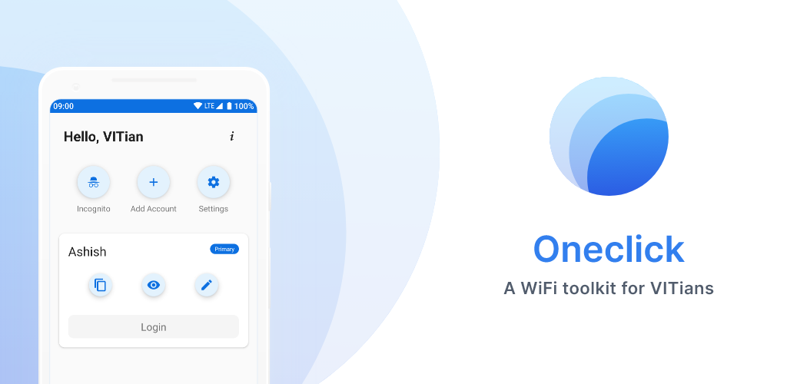

# One-Click

A WiFi management app for VIT students 

## What does this app do?

* User's login credentials are stored locally.
* Easily login from your notification panel using Quick Setting Tile
* Easily login from your home screen using Home Screen Widgets
* Add more than one account to use later
* Log in using your friend's account in Incognito mode
* Dark Theme !!

## How is this built?

This app is 100% written in **Kotlin**. Used **MVVM** architecture with **Android Architecture Components**, **Dagger 2** for dependency injeciton and **Android MDC** for latest UI components. 

## Credits

- Thanks [Remo Somesh](https://www.uplabs.com/k_s_somesh11) for wonderful UI/UX
- [Fuel](https://github.com/kittinunf/Fuel)
