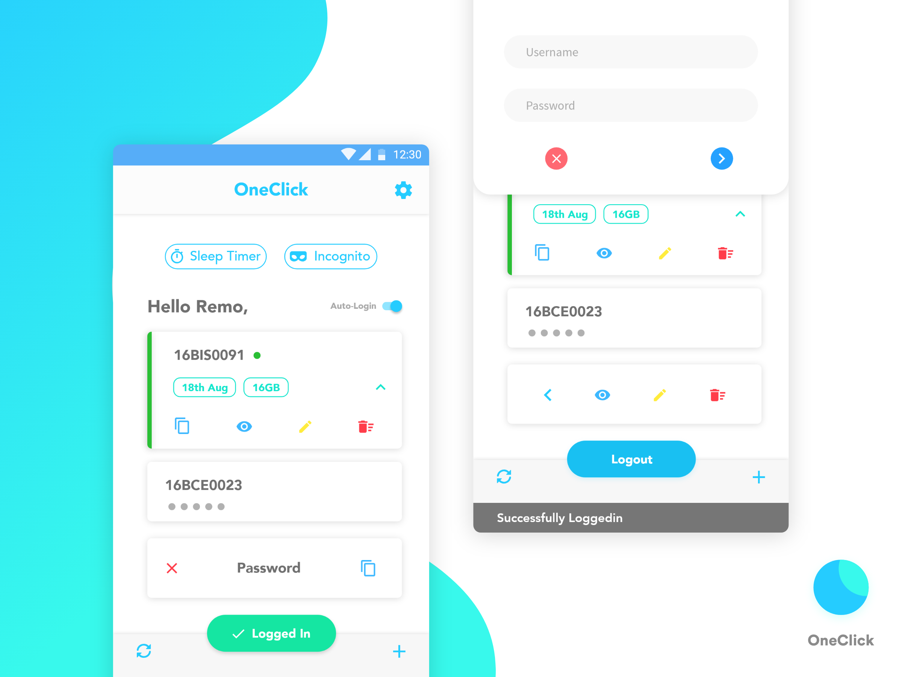

# One-Click

A WiFi management app for VIT students 

## What does this app do?

- User's login credentials are stored locally. 
- Everytime when connected to a VIT WiFi, the user can login using either quick settings tile, home screen widget or the app itself. 
- Users can create and choose between multiple accounts to login to VIT WiFi system.
- Users can also see their WiFi data useage right in their app even when offline. 
- Other features include logout timer and incognito mode.

## How is this built?

This app is 100% written in **Kotlin**. It uses **MVVM** architecture with **Android Architecture Components**, **Dagger 2** for dependency injeciton and **Android MDC** Material Design 2.0 for latest UI components. 

## Credits

- Thanks [Remo Somesh](https://www.uplabs.com/k_s_somesh11) for wonderful UI/UX
- [Fuel](https://github.com/kittinunf/Fuel)
- [LoadingButton](https://github.com/leandroBorgesFerreira/LoadingButtonAndroid)
